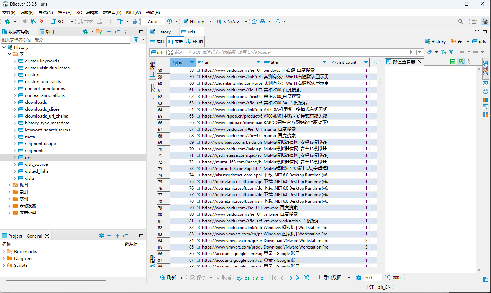
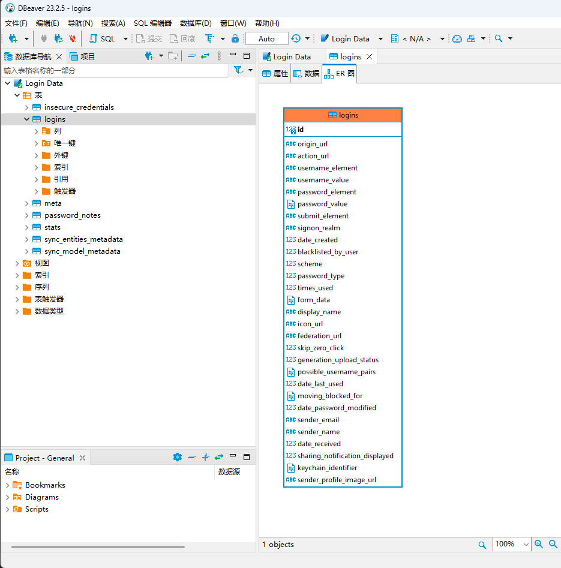
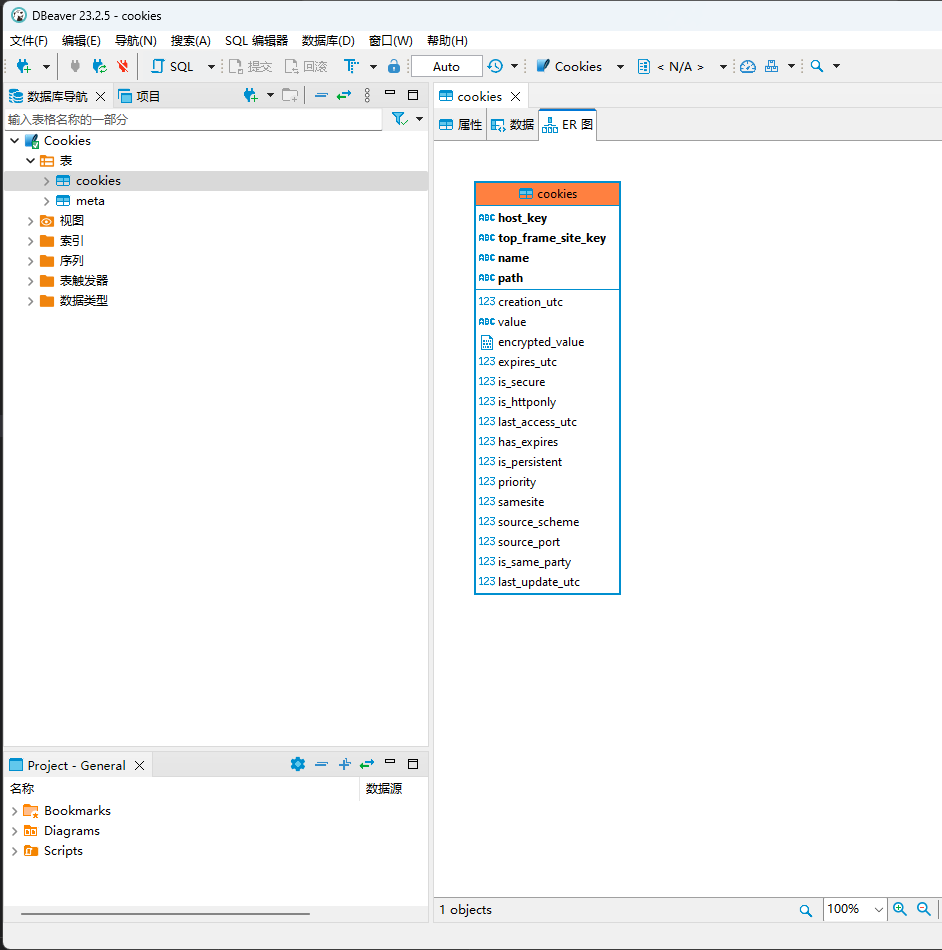

## Chrome系列浏览器的信息提取

Chrome浏览器的数据默认保存在 `%LocalAppdata%\Google\Chrome\User Data`内，此目录中 `Local State`文件保存了 `MasterKey`信息，`Default`目录保存了默认配置信息，如有更多配置，则保存于 `Profile 数字`的文件夹中

### 历史记录

对于每一个配置文件夹，其中的 `History`文件即为保存为Sqlite数据库格式的历史记录信息

直接读取数据库中需要的部分即可

### 密码

对于每一个配置文件夹，其中的 `Login Data`文件即为保存为Sqlite数据库格式的密码信息

其中，password_value列为加密数据，对于Chrome 80之前的版本，可以直接使用DPAPI解密，对于80之后的版本，则修改为AES-256-GCM加密，加密过程可以参考[os_crypt_win.cc](https://source.chromium.org/chromium/chromium/src/+/main:components/os_crypt/sync/os_crypt_win.cc)，解密时可以根据开头为v10或v11判断为新版本加密，对于新版本，password_value的开头版本号为3位，其后12位为IV。AES加密使用的key来自浏览器数据目录的Local State文件，此文件内容为json，其中encrypted_key是base64编码的key。

### Cookies

对于每一个配置文件夹，其中的 `Cookies`文件即为保存为Sqlite数据库格式的Cookies信息，对于较新的版本，文件在 `Network\Cookies`路径

其中，encrypted_value列为加密数据，加密解密方式与上文密码部分相同，直接读取数据库中需要的部分并解密Cookies值即可。

### 书签

对于每一个配置文件夹，其中的 `Bookmarks`文件即为保存为Json数据库格式的书签信息，直接读取文件中需要的部分或直接读取全部文件内容即可。

### 扩展

对于每一个配置文件夹，其中的 `Extensions`文件夹保存了扩展程序的信息，其中可以找到 `扩展ID\版本号\manifest.json`文件，读取文件中name对应的值，即可获得各个ID对应的插件名。

各个扩展的数据主要保存于 `Local Extension Setting`s和 `Sync Extension Settings`，如有需要可以直接复制文件夹并替换回本地即可（需要本地安装该插件）

### Local Storage

对于每一个配置文件夹，其中的 `Local Storage`文件夹保存了本地存储的信息，有时只获取Cookies不足以登录网站，可以复制此文件夹替换本地文件夹即可。

## 项目地址

此工具开源于 [https://github.com/qwqdanchun/Pillager](https://github.com/qwqdanchun/Pillager) ，欢迎大家关注和使用
