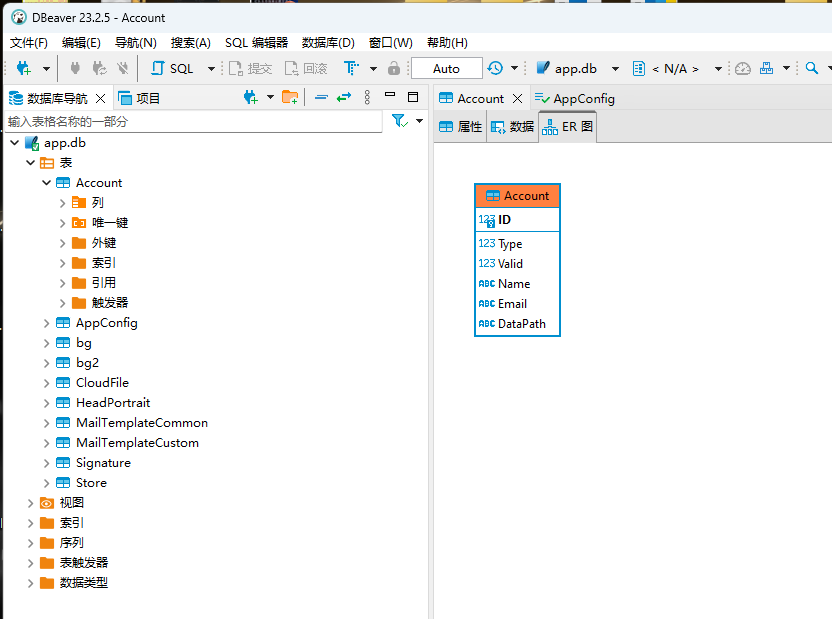
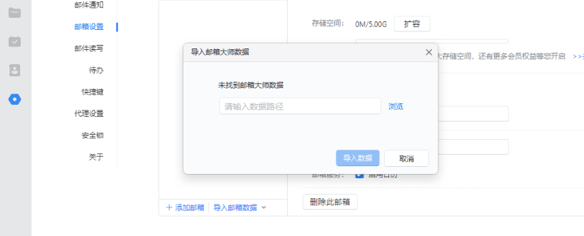

## 网易邮箱大师的账号接管

网易邮箱大师的数据文件默认保存在 `%LocalAppdata%\Netease\MailMaster\data\app.db`内，此文件为Sqlite格式储存

### 获取目录

app.db的Account表中的每一行对应一个账号，DataPath项对应的值即为账号信息保存目录。

### 接管账号

本地安装网易邮箱大师后，将上一步获取的文件夹，复制回本地，依次点击设置-邮箱设置-导入邮箱数据，选择文件夹路径即可

## 项目地址

此工具开源于 [https://github.com/qwqdanchun/Pillager](https://github.com/qwqdanchun/Pillager) ，欢迎大家关注和使用
